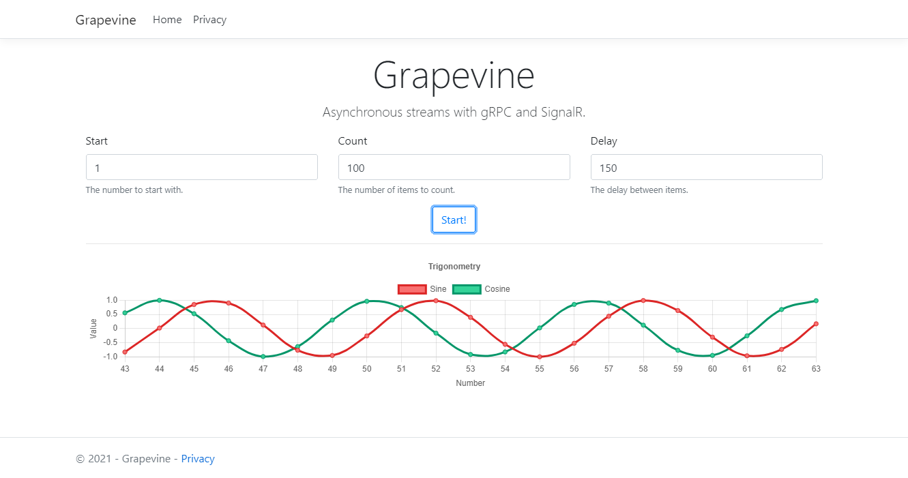

# Grapevine
Asynchronously broadcast gRPC streams over SignalR.

# Introduction
This is a proof-of-concept on broadcasting [gRPC](https://grpc.io) streams asynchronously to front-end clients via
[WebSockets](https://developer.mozilla.org/en-US/docs/Web/API/WebSockets_API), [gRPC-web](https://grpc.io/docs/platforms/web/) 
or [SignalR](https://dotnet.microsoft.com/apps/aspnet/signalr).

# Getting started

## Prerequisites

- [Git](https://git-scm.com) - Version Control System.
- [.NET 5](https://dot.net) or later - Free, cross-platform, open source developer platform for building all your apps.

## Installation

Please check the [official .NET documentation](https://dotnet.microsoft.com/download) for installation instructions before you start.

> All console commands are written for the Windows Command Prompt and may not produce the desired effects when used in other terminals.

### 0. TL;DR Command List

Here's the summary:

    git clone https://github.com/sixpeteunder/grapevine.git
    cd grapevine
    dotnet restore
    dotnet dev-certs https --trust
    start dotnet run --project Grapevine.Edge
    start dotnet run --project Grapevine.Web
    start dotnet run --project Grapevine.Cli

### 1. Clone the repository

Clone the repsitry using any of these methods.

HTTPS:

    git clone https://github.com/sixpeteunder/grapevine.git
    
SSH:

    git clone git@github.com:sixpeteunder/grapevine.git
    
GitHub CLI:

    gh repo clone sixpeteunder/grapevine

### 2. Switch to the repo folder

    cd grapevine

### 3. Install dependencies

> Warning: These steps may be bandwith-intensive.

Restore .NET dependencies using Nuget:

> This step is automatically performed whenever the code is built or run.

    dotnet restore
    
### 4. Set up project

> macOS doesn't support ASP.NET Core gRPC with TLS. Additional configuration is required to successfully run gRPC services on macOS. 
For more information, see [this document](https://docs.microsoft.com/en-gb/aspnet/core/grpc/troubleshoot?view=aspnetcore-5.0#unable-to-start-aspnet-core-grpc-app-on-macos).

To enable HTTPS during development, you need to [trust the HTTPS development certificate](https://docs.microsoft.com/en-gb/aspnet/core/security/enforcing-ssl?view=aspnetcore-5.0#trust-the-aspnet-core-https-development-certificate-on-windows-and-macos):

> The following command doesn't work on Linux. See your Linux distribution's documentation for trusting a certificate.

    dotnet dev-certs https --trust

Start the gRPC server:

    start dotnet run --project Grapevine.Edge
    
Start the web/SignalR server:

    start dotnet run --project Grapevine.Web
    
(Optional) Start a client application: 

    start dotnet run --project Grapevine.Cli
    
### 5. Develop!

You can now access the gRPC server at [http://localhost:5000](http://localhost:5000) or [https://localhost:5001](https://localhost:5001).

The web/SignalR server can be accessed at [http://localhost:5002](http://localhost:5002) or [https://localhost:5003](https://localhost:5003).
